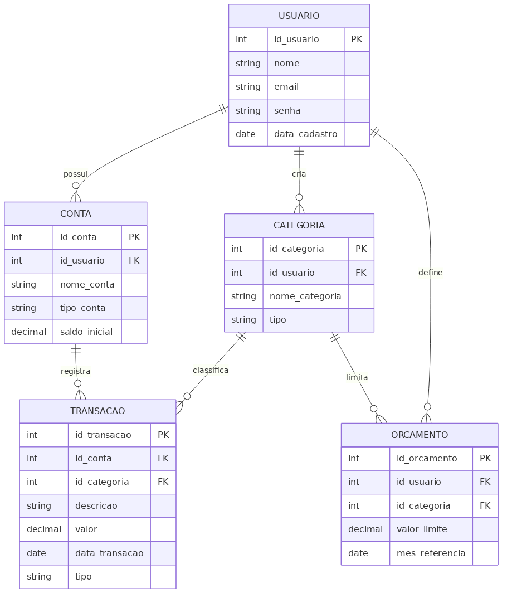
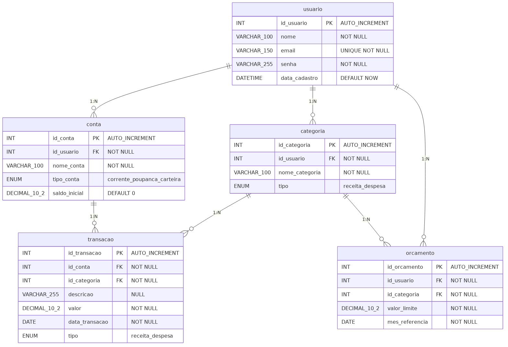
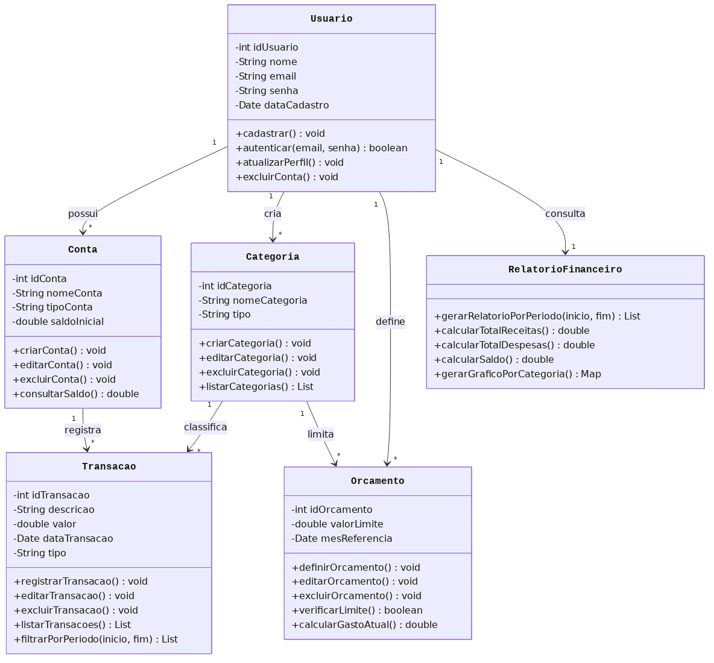
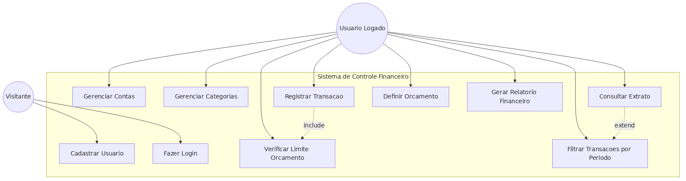
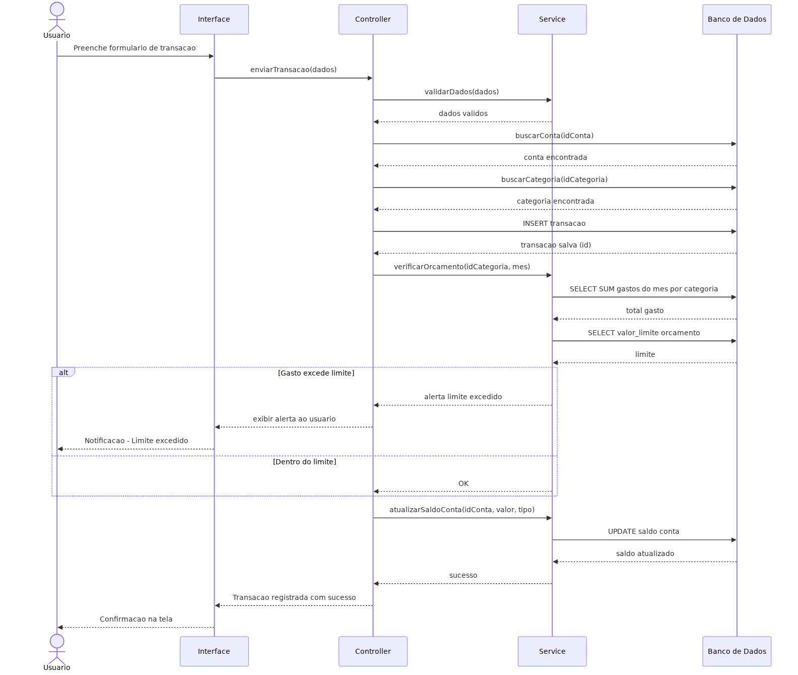
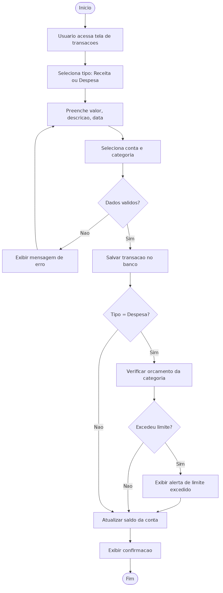
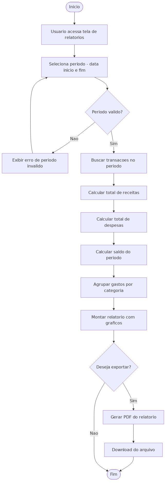

# Sistema de Controle Financeiro Pessoal

Projeto acadêmico de modelagem e implementação de um banco de dados relacional para um **Sistema de Controle Financeiro Pessoal**, desenvolvido como atividade da disciplina de Banco de Dados.

O sistema permite que usuários registrem suas **receitas** e **despesas**, organizem-nas por **categorias**, vinculem-nas a **contas** (carteira, conta corrente, cartão de crédito etc.) e gerem **relatórios mensais** para acompanhamento financeiro.

---

## 🎯 Objetivos

- Aplicar conceitos de **modelagem conceitual, lógica e física** de banco de dados.
- Modelar o sistema utilizando **diagramas UML** (Classes, Caso de Uso, Sequência e Atividades).
- Implementar o banco no **MySQL** através do **HeidiSQL**.
- Documentar todo o processo em PDF e publicar no GitHub.

---

## 🛠️ Tecnologias Utilizadas

- **MySQL** — Sistema Gerenciador de Banco de Dados
- **HeidiSQL** — Ferramenta de administração e execução do script SQL
- **Mermaid** — Linguagem de marcação para criação dos diagramas
- **Markdown** — Documentação do repositório

---

## 📂 Estrutura do Repositório

Todos os arquivos estão disponíveis na raiz do repositório:

| Arquivo | Descrição |
|---------|-----------|
| `README.md` | Este arquivo de documentação |
| `script_sql.sql` | Script SQL com criação de tabelas e dados de teste |
| `01_er_conceitual.png` | Modelo Entidade-Relacionamento Conceitual |
| `02_er_logico.png` | Modelo Entidade-Relacionamento Lógico |
| `03_classes.png` | Diagrama de Classes (UML) |
| `04_caso_uso.png` | Diagrama de Caso de Uso |
| `05_sequencia.png` | Diagrama de Sequência — Registrar Transação |
| `06_atividade_registrar_transacao.png` | Diagrama de Atividades — Registrar Transação |
| `07_atividade_gerar_relatorio.png` | Diagrama de Atividades — Gerar Relatório |

---

## 🗂️ Diagramas

### 1. Modelo ER Conceitual

### 2. Modelo ER Lógico

### 3. Diagrama de Classes

### 4. Diagrama de Caso de Uso

### 5. Diagrama de Sequência — Registrar Transação

### 6. Diagrama de Atividades — Registrar Transação

### 7. Diagrama de Atividades — Gerar Relatório

---

## 🗄️ Estrutura do Banco de Dados

O banco é composto pelas seguintes entidades principais:

- **Usuario** — Dados de cadastro e autenticação
- **Conta** — Contas financeiras do usuário (carteira, banco, cartão)
- **Categoria** — Classificação das transações (alimentação, transporte, salário etc.)
- **Transacao** — Receitas e despesas registradas
- **Orcamento** — Limites mensais de gastos por categoria

---

## ▶️ Como Executar o Script SQL

1. Instale e abra o **HeidiSQL**.
2. Conecte-se ao seu servidor MySQL local.
3. Crie uma nova sessão e abra uma aba de query.
4. Vá em **Arquivo → Carregar arquivo SQL** e selecione `script_sql.sql`.
5. Pressione **F9** para executar o script completo.
6. O banco `controle_financeiro` será criado com todas as tabelas e dados de teste.

---

## 👤 Autor

**William Schroeder**  
Atividade desenvolvida para a disciplina de Banco de Dados.

---

## 📄 Licença

Projeto de uso acadêmico.
